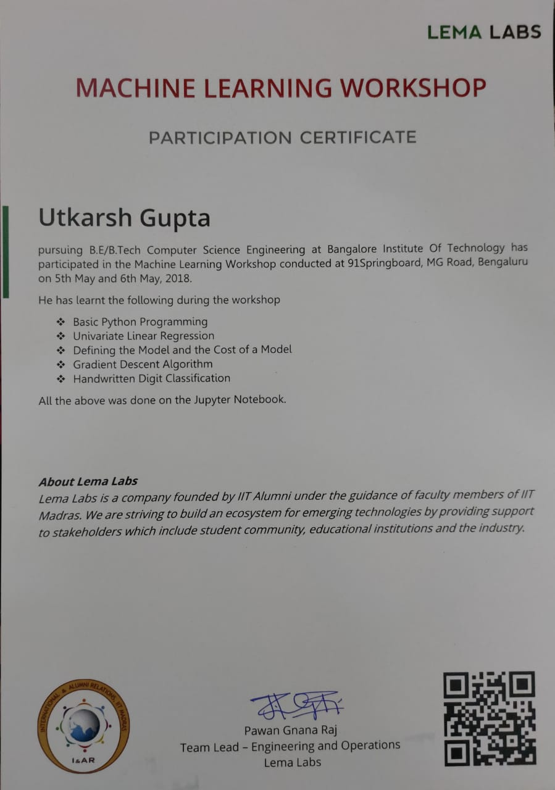

# Handwritten Digit Recognition

This repository contains code to recognize Hand written digits 0, 1, 2, and 3. Classification model is trained for the digits in the database. The cost computation and gradient calculation logic are implemented in the [notebook](Handwritten%20Digit%20Recognition.ipynb).

Kindly follow the notebook to get the concrete understanding of training.

### References
1. Two days [Lema Labs Workshop](https://lemalabs.com/machine-learning-workshop/)

### Certificate
